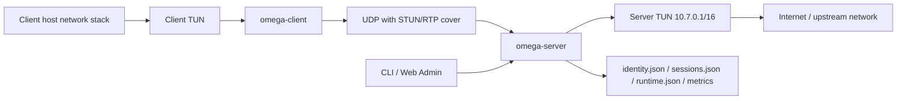

# Architecture

## Состав системы



## Workspace responsibilities

### `omega-core`

Отвечает за низкоуровневые примитивы:

- `protocol.rs` - wire format, STUN wrapper, `ClientHello`, `ServerHello`, `NackMessage`, packet types.
- `crypto.rs` - `SessionKeys`, HKDF key derivation, `FlowId` derivation, AEAD encrypt/decrypt.
- `replay.rs` - sliding anti-replay window.
- `arq.rs` - retransmit queue, gap detector, loss estimator.
- `chaos.rs` - lightweight PRNG для целевых размеров пакетов.
- `raptorq_mgr.rs` - FEC primitives и state machine, пока не доведенные до живого packet path.

### `omega-server`

Собирает runtime вокруг `omega-core`:

- принимает UDP-пакеты;
- обслуживает handshake;
- создает и поддерживает TUN;
- ведет identity store пользователей и устройств;
- управляет активными сессиями и IP-лизами;
- пишет session/runtime snapshots;
- публикует Prometheus metrics;
- поднимает встроенную web admin панель.

### `omega-client`

Поднимает локальный tunnel endpoint:

- читает env-конфиг и runtime profile;
- выполняет handshake;
- создает TUN;
- шифрует/дешифрует datapath;
- на Windows настраивает маршруты, MTU, DNS и временно отключает IPv6 на физических адаптерах;
- пишет diagnostics JSON.

## Wire format

Обычный data packet внутри UDP выглядит так:

```text
[RTP Header 12B][FlowId 16B][Seq 4B][PacketType 1B][Encrypted payload][Poly1305 tag 16B]
```

Идея такая:

- `RTP Header` дает cover traffic под WebRTC-like профиль.
- `FlowId` идентифицирует tunnel session.
- `Seq` используется для nonce/replay/ARQ.
- `PacketType` различает `Data`, `KeepAlive`, `Close`, `Nack`, `FecControl`.
- Payload шифруется через `ChaCha20-Poly1305`.

Handshake не идет в этом формате. Он передается как `STUN Binding Request/Response`, внутри которого лежат `ClientHello` и `ServerHello`.

## Handshake flow

1. Клиент генерирует `ML-KEM-768` keypair.
2. Клиент отправляет `ClientHello` в STUN request.
3. В `ClientHello` уже лежат:
   - версия протокола;
   - желаемый MTU;
   - флаг `fec_support`;
   - ML-KEM encapsulation key;
   - `device_id`, `device_token`, `platform`, `device_name`.
4. Сервер:
   - парсит STUN;
   - проверяет версию;
   - аутентифицирует устройство через `IdentityStore`;
   - завершает существующие сессии этого устройства;
   - проверяет лимит concurrent sessions пользователя;
   - выделяет tunnel IP;
   - делает encapsulate и получает shared secret;
   - derives `SessionKeys`, `FlowId`, `chaos_seed`, `ssrc`;
   - создает `SessionState`;
   - отвечает `ServerHello` в STUN response.
5. Клиент decapsulate, derives те же ключи и поднимает локальный TUN.

### Что сервер реально проверяет

- `device_id` должен существовать.
- `device_token` должен совпадать по hash.
- устройство не должно быть revoked.
- пользователь должен быть `active`.
- лимит сессий пользователя не должен быть превышен.

### Что происходит при reconnect одного и того же устройства

Сервер вызывает `terminate_device_sessions(device_id)` еще на handshake. Это делает reconnect idempotent: старые активные сессии устройства вычищаются, новая сессия занимает их место.

## Data path

### Из TUN в UDP

И клиент, и сервер делают почти симметричную работу:

- читают IP packet из TUN;
- определяют профиль RTP cover:
  - маленькие пакеты ближе к audio/Opus;
  - большие ближе к video/VP8;
- берут `target_size` из `ChaosPrng`;
- добивают payload padding-ом в рамках `padding_budget`;
- шифруют payload с `aad = RTP + Omega headers`;
- кешируют отправленный пакет в `RetransmitQueue`;
- отправляют пакет по UDP;
- при повышенной потере делают несколько redundant sends.

### Из UDP в TUN

На приеме:

- проверяется `FlowId`;
- проходит anti-replay check;
- пакет дешифруется;
- обновляется `last_seen`;
- при необходимости фиксируется roam клиента на новый `src_addr`;
- `GapDetector` ищет пропуски и, если нужно, отправляет `NackMessage`;
- `RetransmitQueue` обслуживает входящие NACK и повторно шлет кешированные пакеты;
- полезная IP-нагрузка уходит обратно в TUN.

## Надежность канала

### Что реально работает сейчас

- `RetransmitQueue` кеширует до 256 пакетов.
- `GapDetector` строит 64-битную карту пропусков.
- `LossEstimator` держит sliding window на 256 событий.
- `padding_budget` и `redundancy_extra` динамически меняются после NACK.

### Что пока только подготовлено

- В кодовой базе есть `FecEncoder`, `FecDecoder`, `FecState`, `PacketType::FecControl`.
- Но текущие loops клиента и сервера не кодируют и не декодируют FEC-пакеты как часть живого datapath.
- Поэтому в документации проекта FEC надо считать "заготовкой/примитивом", а не завершенной runtime-фичей.

## Session model

`SessionManager` хранит:

- `FlowId -> SessionState`
- `tunnel_ip -> flow`
- `user_id -> flows`
- `device_id -> flows`
- `device_id -> leased tunnel IP`

Поведение:

- TTL сессии: `120` секунд без активности.
- Период cleanup: `30` секунд.
- Max sessions in memory: `10_000`.
- IP pool: `10.7.0.2 - 10.7.255.254`.

`ActiveSessionView` в snapshots содержит:

- `flow_id`
- `user_id`
- `device_id`
- `tunnel_ip`
- `client_addr`
- `age_secs`
- `idle_secs`
- `loss_ratio`
- `fec_enabled`

## Identity model

`IdentityStore` хранит три группы данных:

- `users`
- `devices`
- `audit_events`

Особенности:

- revoked devices и deleted users при загрузке не возвращаются в живую память.
- device token не хранится открытым видом; сохраняется только SHA-256 hash с `OMEGA_TOKEN_PEPPER`.
- каждое важное действие дописывает `AuditEvent`.
- `register_device` показывает token только один раз.

## Observability

### Клиент

`ClientDiagnostics` пишет JSON каждые 5 секунд:

- активный профиль;
- tunnel mode;
- DNS/IPv6 policy;
- requested/negotiated MTU;
- handshake RTT;
- path quality;
- UDP DNS diagnostic;
- счетчики NACK/retransmit;
- последние timestamps пакетов.

### Сервер

Сервер пишет два отдельных JSON snapshot-а:

- `sessions.json` - список активных сессий;
- `runtime.json` - runtime config + summary + sessions.

Также сервер публикует Prometheus metrics, например:

- `omega_active_sessions`
- `omega_packets_in_total`
- `omega_packets_out_total`
- `omega_handshake_success_total`
- `omega_handshake_failures_total`
- `omega_nack_sent_total`
- `omega_retransmit_sent_total`

## Admin surfaces

### CLI

Через `omega-server admin ...` можно:

- создавать и блокировать пользователей;
- регистрировать и отзывать устройства;
- смотреть активные сессии;
- смотреть runtime snapshot;
- смотреть audit;
- завершать сессию через командную очередь.

### Built-in web admin

`web_admin.rs` поднимает минимальный HTTP UI без внешнего фреймворка. Он позволяет:

- создать пользователя;
- зарегистрировать устройство;
- block/unblock/delete пользователя;
- revoke устройство;
- terminate активную сессию;
- скопировать шаблон `.env` для клиента.
