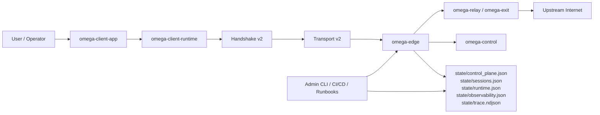

# Architecture

## Что это за система сейчас

`Omega VPN` - это Rust workspace с собственным `Omega v2` протоколом, hybrid handshake, transport v2, stealth/persona слоем, relay fabric, typed control plane, desktop launcher и встроенной SRE/security обвязкой.

Проект состоит не из одного монолита, а из нескольких четко разделенных слоев.

## Архитектурная схема

## Workspace по слоям

### Foundations

- `omega-core-wire` - wire format, handshake messages, transport v2 frames.
- `omega-core-crypto` - hybrid handshake secrets, key schedule, key update derivation.
- `omega-transport` - transport v2 core, replay protection, retransmit/FEC/reliability logic.
- `omega-stealth` - personas, detectability budgets, morphing and cover policy.

### Control and fabric

- `omega-control` - users, devices, tickets, sessions, policies, audit chain, control-plane store.
- `omega-relay` - relay graph, route scoring, failover simulation and handoff concepts.
- `omega-exit` - exit-role contracts и egress policy surface.

### Runtime

- `omega-edge` - серверный runtime: handshake, session manager, datapath, metrics, observability, fabric coupling.
- `omega-client-runtime` - привилегированный клиентский runtime: handshake, transport, TUN, routing, diagnostics.

### App and compatibility

- `omega-client-app` - launcher UX, lifecycle, profile management, secure update path.
- `omega-server` - server app entrypoint и admin CLI.
- `omega-client` - compatibility shim для legacy env-driven запуска.
- `omega-core` - compatibility facade поверх foundation crates.

## Ключевые runtime flows

### Provisioning

1. Оператор создает пользователя через `omega-server admin create_user`.
2. Для устройства выдается `device_id` и `device_token` через `register_device`.
3. Эти данные попадают в control plane и дальше используются клиентом при первичной настройке.

### Client connect

1. `omega-client-app` читает `omega-client/state/app-config.json`.
2. Launcher запускает `omega-client-runtime` как foreground или background process.
3. Runtime идет в `handshake v2`: `Init -> Retry -> Validated -> Established/Resumed`.
4. Сервер в `omega-edge` валидирует устройство, policy и fabric context через `omega-control`.
5. После handshake соединение переходит на `transport v2` и начинает передавать `data/ack/control/path/fec/padding` frames.

### Steady-state datapath

- Клиент и сервер работают через `transport v2`, а не через старый packet-only path.
- Path manager следит за `RTT`, `jitter`, `loss`, reordering и MTU.
- Reliability engine выбирает retransmit/FEC/duplicate strategy под текущие условия.
- Stealth engine накладывает persona-aware timing и cover budget поверх transport decisions.
- Fabric слой может рекомендовать failover или route handoff без полного переписывания control plane.

### Operations and rollout

- `deploy-server.yml` собирает `omega-server`, загружает bundle на VPS и запускает `deploy/update_server.sh`.
- `update_server.sh` обновляет бинарник, systemd unit и alert rules, затем проверяет rollout guard.
- После deploy workflow повторно применяет `deploy/setup_nat.sh` и прогоняет `deploy/diagnose_server.sh`.
- `bootstrap-network.yml` используется отдельно, когда нужно вручную переподнять сетевой bootstrap или починить firewall/NAT.

## Источники истины

### Server state

- `state/control_plane.json` - source of truth для users/devices/sessions/tickets/policies/fabric nodes.
- `state/sessions.json` - текущие активные сессии и session views.
- `state/runtime.json` - runtime snapshot сервера.
- `state/observability.json` - rollout guard, alerts, SRE signals.
- `state/trace.ndjson` - correlation-aware trace journal.

### Client state

- `omega-client/state/app-config.json` - launcher config.
- `omega-client/state/lifecycle.json` - статус runtime для launcher/UI.
- `omega-client/state/diagnostics.json` - client diagnostics snapshot.
- `omega-client/state/runtime-control.json` - launcher -> runtime control file.
- `omega-client/state/resumption_ticket.hex` - локально сохраненный opaque resumption ticket.

## Что важно не перепутать

- `omega-client-app` и `omega-client-runtime` - это разные слои. Первый отвечает за UX и orchestration, второй - за сеть и привилегированные операции.
- `omega-server` - это thin entrypoint, а не место основной серверной логики. Большая часть server runtime находится в `omega-edge`.
- `omega-control` - фактический control-plane слой. Старый `identity.json` нужен только для migration/compatibility сценариев.
- `REPO_MAP_V2.md` описывает crate boundaries точнее, чем старые monolithic mental models.

## Текущие ограничения

- datapath сейчас `UDP-only`;
- tunnel family сейчас `IPv4-only`;
- полного TCP fallback нет;
- updater пока без transparency log и без полного TUF timestamp/snapshot role separation;
- local client secret storage пока не вынесен в OS-native keystore.

Эти ограничения не отменяют текущую зрелость проекта, но их важно учитывать при beta rollout и production planning.