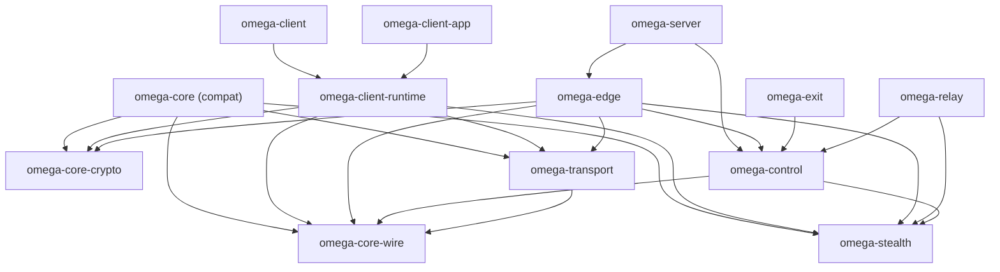

# Dependency DAG

## Mermaid DAG

## Dependency Matrix

| Crate | Direct deps |
| --- | --- |
| `omega-core-crypto` | none |
| `omega-core-wire` | none |
| `omega-stealth` | none |
| `omega-transport` | `omega-core-wire` |
| `omega-control` | `omega-core-wire`, `omega-stealth` |
| `omega-relay` | `omega-control`, `omega-stealth` |
| `omega-exit` | `omega-control` |
| `omega-edge` | `omega-core-crypto`, `omega-core-wire`, `omega-transport`, `omega-stealth`, `omega-control` |
| `omega-client-runtime` | `omega-core-crypto`, `omega-core-wire`, `omega-transport`, `omega-stealth` |
| `omega-client-app` | `omega-client-runtime` |
| `omega-client` | `omega-client-runtime` |
| `omega-server` | `omega-edge`, `omega-control` |
| `omega-core` | `omega-core-crypto`, `omega-core-wire`, `omega-transport`, `omega-stealth` |

## Rules

- `omega-edge` не может зависеть от `omega-client-runtime`.
- `omega-client-runtime` не может зависеть от `omega-server` или `omega-control` storage internals.
- `omega-transport` не может зависеть от app/runtime/UI crates.
- `omega-control` не может зависеть от `omega-edge`.
- `omega-relay` и `omega-exit` могут зависеть только вниз по DAG.

## Why This Matters

Эта DAG-структура делает возможным:

- изолированное тестирование transport/stealth;
- дальнейшее разрастание relay fabric без циклов;
- сохранение тонких app entrypoints;
- более понятный profiling hot path;
- постепенную миграцию старых shim-crates без архитектурного долга.
